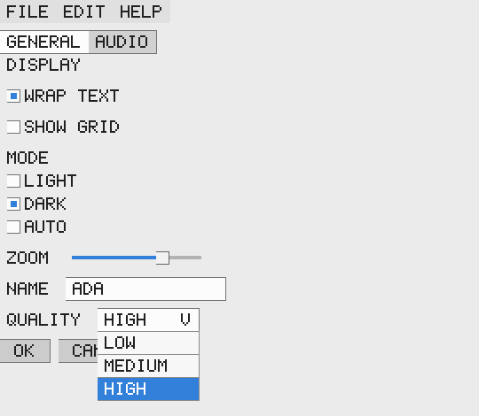
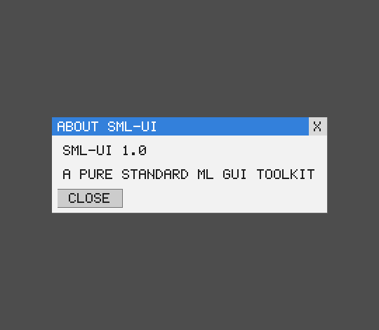

# sml-ui

[](https://github.com/sjqtentacles/sml-ui/actions/workflows/ci.yml)

A pure, self-drawn, **immediate-mode widget toolkit** for Standard ML - the
flagship of the pure-SML GUI stack. Each frame the host describes a `widget`
tree; the toolkit lays it out (via [`sml-layout`](https://github.com/sjqtentacles/sml-layout)),
folds a pure input-event model into retained state, emits `event`s, and renders
to a backend-agnostic [`sml-canvas2d`](https://github.com/sjqtentacles/sml-canvas2d)
scene or straight to an [`sml-image`](https://github.com/sjqtentacles/sml-image)
RGBA bitmap.

Everything is **pure and deterministic** - no OS, clock, RNG, threads, or FFI -
so rendered frames are **byte-identical across MLton and Poly/ML**. That is what
makes a GUI toolkit unit-testable headlessly: the test suite renders frames and
compares a **golden checksum** of the pixels against a committed constant on
both compilers.





*Both images are rendered headlessly by `make example` and are byte-identical on
MLton and Poly/ML.*

## Widget set

`Label`, `Button`, `Checkbox`, `Radio` group, `Slider`, `TextField`,
`Dropdown`/combo box, `Tabs`, `MenuBar`, `Scroll` area, `Modal`
dialog/window-chrome, and `Panel` row/column containers - a self-drawn,
OS-independent (Dear-ImGui-style) desktop look. Dropdown popups, menus, and
modals render as z-ordered overlays; an open modal traps input from the base
tree.

## How it works

The host runs one pure function per frame. Prior `state` (focus, text buffers,
scroll offsets, open menu) plus a `frameinput` (mouse/keyboard, no OS) and the
`widget` tree go in; new `state`, fired `event`s, and a rendered image come out.

```sml
val cfg = { width = 320, height = 120, font = font, theme = Ui.defaultTheme }

val tree =
  Ui.Panel
    { dir = Layout.Column, gap = 8.0
    , children =
        [ Ui.Label "HELLO"
        , Ui.Checkbox { id = "wrap", label = "WRAP TEXT", checked = true }
        , Ui.Button { id = "ok", label = "OK" } ] }

(* Feed input, get back new state + events + an Image.image you can encode. *)
val { state = state', events, image } = Ui.render cfg Ui.init input tree
```

`Ui.frame` returns a `Canvas2d.scene` instead of an image if you want to drive a
different backend (e.g. SVG); `Ui.render` is the convenience headless rasterizer.

### Determinism

The B0 lesson - never let two compilers disagree on a pixel:

- All rounding is `floor(x + 0.5)`, never `Real.round` (whose round-half-to-even
  ties resolve differently across compilers).
- Every coordinate handed to the canvas is **snapped to an integer**, so the
  rasterizer never sees a half-pixel tie.
- Every color channel is **quantized to an exact `n/255` byte fraction** before
  packing, so float multiplies can't drift a channel by one LSB.

The golden-checksum tests lock this in: each widget renders to a frame whose
FNV-1a digest is asserted against a committed constant on both compilers.

## Build & test

```sh
make test        # build + run the suite under MLton
make test-poly   # build + run the suite under Poly/ML (5.9.1)
make all-tests   # both, must be byte-identical green
make example     # render the demo UI to assets/ui.png + assets/ui_modal.png
```

## License

MIT - see [LICENSE](LICENSE).
